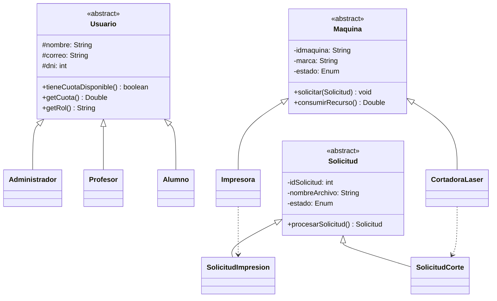
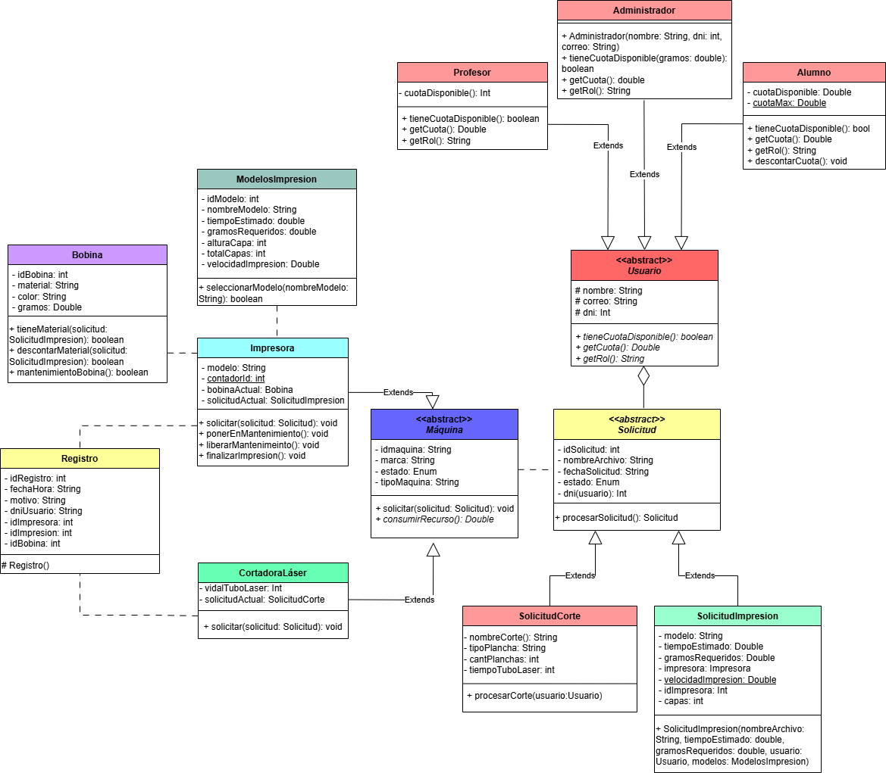

# Gestor de Laboratorio Maker 

> Proyecto académico desarrollado en **Java** con persistencia mediante **JPA/Hibernate** sobre **MySQL**, modelado a partir de un diagrama UML con herencia, polimorfismo y relaciones entre entidades.

[](https://www.java.com/)
[](https://hibernate.org/)
[](https://www.mysql.com/)
[]()

---

## Descripción

Este sistema gestiona el flujo completo de trabajo de un laboratorio que combina **impresión 3D** y **corte láser**: administra usuarios con distintos roles, máquinas, solicitudes de trabajo, materiales (bobinas) y el registro de eventos del laboratorio.

El diseño está basado en un diagrama UML que define tres jerarquías principales mediante **herencia** (`Usuario`, `Máquina`, `Solicitud`), todas implementadas en JPA con la estrategia **`JOINED`**: cada subclase persiste en su propia tabla, unida a la tabla padre por clave primaria compartida.

## Modelo de dominio

### Jerarquía de Usuarios
`Usuario` (abstracta) es extendida por `Administrador`, `Profesor` y `Alumno`, cada uno con su propia lógica de cuota disponible de material.

### Jerarquía de Máquinas
`Máquina` (abstracta) es extendida por `Impresora` (impresión 3D) y `CortadoraLaser` (corte láser), cada una con su propio ciclo de mantenimiento y consumo de recursos.

### Jerarquía de Solicitudes
`Solicitud` (abstracta) es extendida por `SolicitudImpresion` y `SolicitudCorte`, representando los dos tipos de trabajo que puede procesar el laboratorio.



## Arquitectura

El proyecto sigue una arquitectura de MVC:

```
laboratorio/
├── Modelos/          # Entidades JPA (Usuario, Maquina, Solicitud y sus jerarquías)
├── Controladores/     # Lógica de negocio y validaciones
└── Persistencia/      # DAOs — acceso a datos vía JPA/Hibernate
```

| Capa | Responsabilidad |
|---|---|
| **Modelos** | Entidades anotadas con JPA, reglas de negocio propias de cada clase (ej. `procesarSolicitud()`) |
| **Controladores** | Orquestan casos de uso (crear solicitud, validar cuota, etc.) y delegan en los DAOs |
| **Persistencia** | Operaciones CRUD contra la base de datos mediante `EntityManager` |

## Tecnologías utilizadas

- **Java 17+**
- **JPA (Jakarta Persistence API)** con **Hibernate** como proveedor
- **MySQL** como motor de base de datos
- Estrategia de herencia **`InheritanceType.JOINED`** para las jerarquías `Usuario`, `Máquina` y `Solicitud`

> Asegurate de tener una base de datos MySQL creada y accesible antes de ejecutar el proyecto. El esquema de tablas se genera automáticamente según la configuración de Hibernate (`hbm2ddl.auto`).

## Diagrama UML

El diseño completo de clases, atributos y relaciones se modeló a partir del siguiente diagrama:



## Autoría

Proyecto desarrollado como trabajo académico.

---

<p align="center">
  <sub>Hecho con ☕</sub>
</p>
